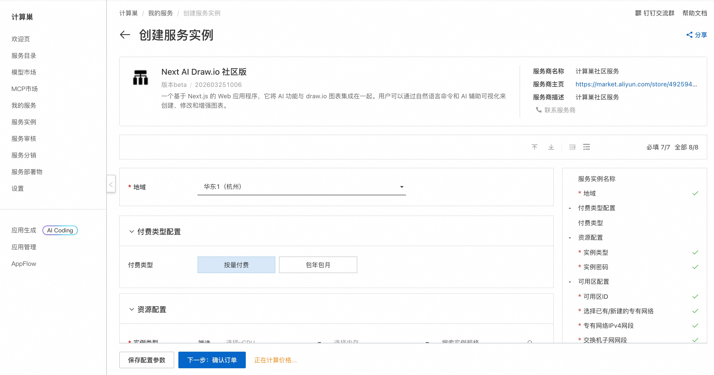
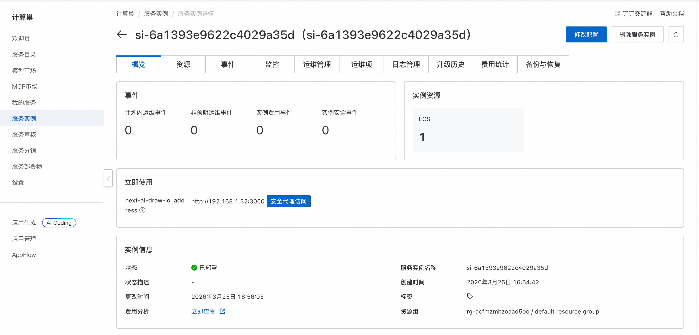
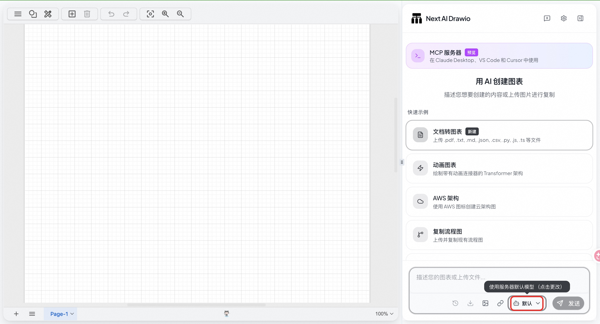
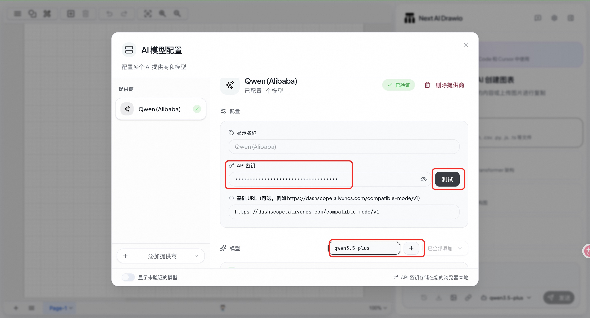
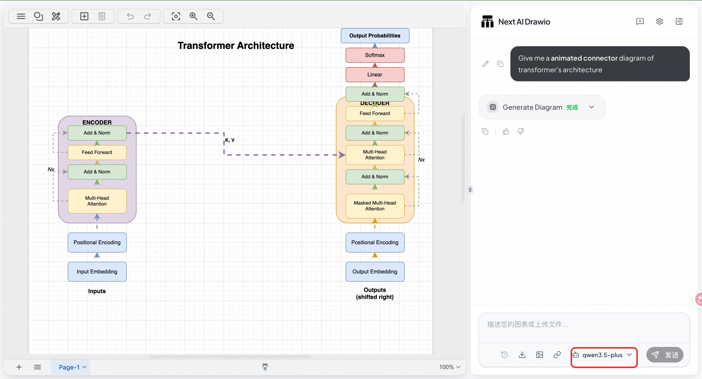

# Next AI Draw.io 服务简介

Next AI Draw.io 一个基于 Next.js 的 Web 应用程序，它将 AI 功能与 draw.io 图表集成在一起。用户可以通过自然语言命令和 AI 辅助可视化来创建、修改和增强图表。

## 🚀 部署流程

1. 访问计算巢 Next AI Draw.io 社区版 [部署链接](https://computenest.console.aliyun.com/service/instance/create/cn-hangzhou?type=user&ServiceId=service-b14a4e96c42749c0872c)，按页面提示填写部署参数：  
    

2. 参数配置完成后，系统将自动生成**费用预估明细**。确认无误后点击 **下一步：确认订单**。

3. 在订单确认页，核对实例信息与费用，点击 **立即创建** 开始自动部署。

4. 部署完成后，通过**安全代理访问**：  
    

5. 访问服务，点击**默认**修改模型：
    

6. 配置 API Key（[获取 Bailian API Key](https://bailian.console.aliyun.com/cn-beijing?apiKey=1&tab=model#/api-key)、配置模型并测试:
    

7. 选择已配置的模型，开始使用 AI 绘图：
    

## 📚 使用指南

使用请参考 Next AI Draw.io [官方文档](https://docs.siliconflow.cn/cn/usercases/use-siliconcloud-in-nextaidrawio) 了解完整功能。